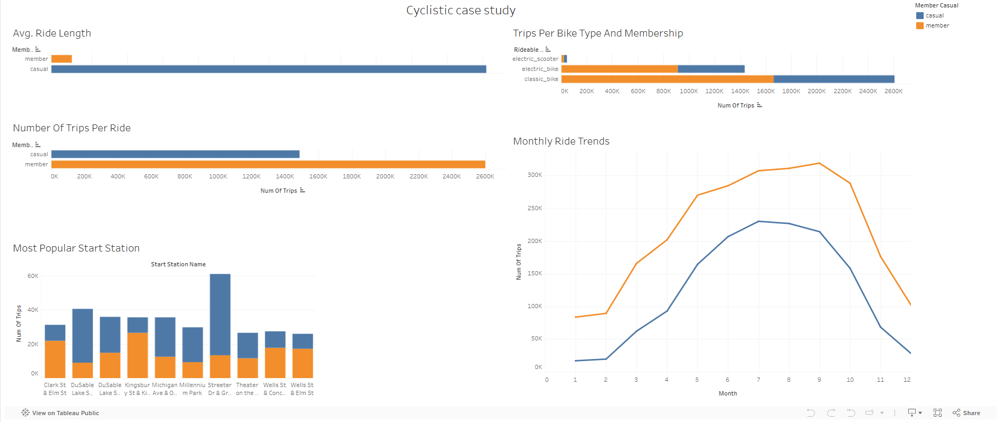

# Google Data Analytics Capstone Project: Cyclistic

## Introduction
This case study demonstrates the skills I’ve gained from the **Google Data Analytics Professional Certificate** course. I’ll use these skills to complete the tasks of a data analyst for the fictional bike-share company **Cyclistic**. Following the data analysis process (**Ask, Prepare, Process, Analyze, Share, Act**), I’ll complete the business task and help the company make data-driven decisions.

---

## Scenario
Cyclistic’s Director of Marketing believes the company’s future depends on maximizing annual memberships. My team aims to understand how **casual riders** and **annual members** use Cyclistic bikes differently. From these insights, we’ll design a marketing strategy to convert casual riders into annual members.

---

## About the Company
Cyclistic launched its bike-share program in 2016, growing to a fleet of **5,824 bicycles** across **692 stations** in Chicago. Cyclistic offers:
- Single-ride passes
- Full-day passes
- Annual memberships

Annual members are more profitable than casual riders, and the company aims to convert more casual riders into members.

---

## Ask
### Business Task
Analyze Cyclistic’s bike usage data to identify differences between annual members and casual riders and provide insights to shape marketing strategies.

### Stakeholders
- **Director of Marketing**: Oversees campaigns and initiatives.
- **Marketing Analytics Team**: Collects and analyzes data.
- **Executive Team**: Approves marketing strategies based on data insights.

---

## Prepare
### Data Sources
- **Dataset**: Cyclistic bike-share trip data for the past 12 months.
- **Source**: Motivate International Inc.
- **Privacy**: No personally identifiable information (PII) included.

---

## Process
### Data Cleaning
#### Tools: **Excel**, **BigQuery**

#### Excel Steps:
1. Downloaded 12 months of trip data.
2. Created columns for `ride_length` and `day_of_week`.
3. Formatted columns and removed errors and missing values.
4. Removed rides under 1 minute and longer than 24 hours.
5. Checked for and removed duplicates and null values.

#### BigQuery Steps:
1. Combined multiple datasets into a single table.
2. Removed duplicate records and null columns.
3. Ensured data consistency and proper formatting.

---

## Analyze
### Tools: BigQuery

### Metrics:
- Total number of trips per rider type.
- Total number of trips per rider type per bike type.
- Average ride length per rider type.
- Total trips and average trip length per rider type per month and day.

### Methods:
- SQL queries for data aggregation and calculations.
- Grouping and filtering data to identify trends.

---

## Share
### Tools: Tableau
The dashboard I created for this project can be found on Tableau [here](https://public.tableau.com/app/profile/abdulrahman.banat/viz/CyclisticCaseStudy_17418790959190/Dashboard1).



### Visualizations:
- Line charts for monthly ride trends.
- Bar charts for ride length, trip counts, and bike type usage.

### Key Findings:
1. **Trends**:
   - Casual riders take longer rides; members take more frequent trips.
   - Classic bikes are the most used bike type.
   - Peak riding months for both groups are June to August.

2. **Insights**:
   - Casual riders prefer longer, leisurely trips; members prioritize frequent, shorter commutes.
   - Membership promotions could be more effective during summer.

---

## Act
### Recommendations:
1. Launch seasonal discounts and incentives to convert casual riders into members.
2. Promote classic bike usage with special deals and maintenance perks.
3. Introduce flexible membership plans tailored to casual riders’ preferences.

### Deliverables:
- **Report**: Data analysis findings and recommendations.
- **SQL Queries**: Used in BigQuery for data cleaning and analysis.
- **Visualizations**: Tableau charts and dashboards.
- **Supporting Files**: Dataset, processed data, and Tableau workbook.

---

## GitHub Repository
You can find the full project, including datasets, SQL queries, and Tableau files, on my GitHub repository:  
[Cyclistic Project GitHub Link](#) *(Replace with your actual GitHub link)*

---

### How to Use This Repository
1. Clone the repository:
   ```bash
   git clone https://github.com/your-username/your-repo-name.git
